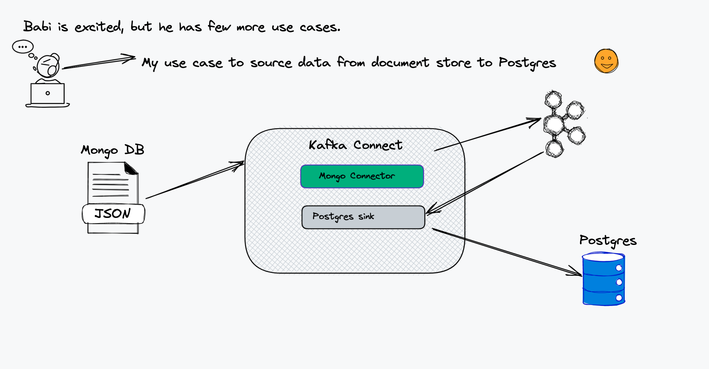
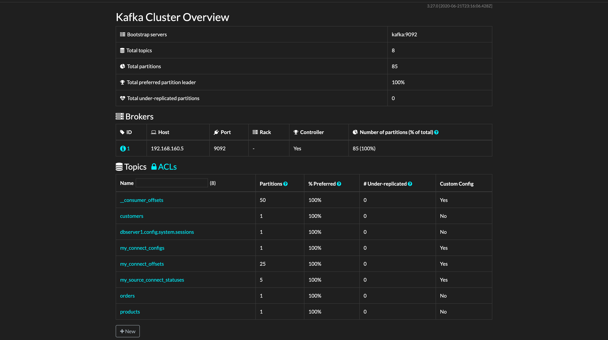

# Change Data Capture from POSTGRES to Elastic Search Using Debezium

A docker compose is used to set up the infrastructure needed for the demo:

- Postgres
- Mongo DB
- Kafka
  - Zookeeper.
  - Kafka Broker.
  - Kafka Connect with [Debezium](https://debezium.io/) and [Postgres](https://github.com/confluentinc/kafka-connect-elasticsearch) Connectors.
  - kafdrop For UI to Kafka topics.

### 

## Usage

I have created script for loading some data in to documents in mongo db. You can find under folder mongo/load-mongo.sh

```shell
export DEBEZIUM_VERSION=1.4 (or latest)

# Build the docker file using docker compose. It will take a while for first time.
docker-compose up --build

# Initialize and load into mongo DB
docker-compose exec mongodb bash -c '/usr/local/bin/load-mongo.sh'

# Configure the connectors. For simplicity I created shell script.
./init.sh
```

Few documents were created after running load-mongo.sh script. The documents are `products`, `customers` and `orders`.

### Check the data in Mongo DB

```shell
docker-compose exec mongodb bash -c 'mongo -u $MONGODB_USER -p $MONGODB_PASSWORD --authenticationDatabase admin inventory --eval "db.products.find()"'
MongoDB shell version v3.6.23
connecting to: mongodb://127.0.0.1:27017/inventory?authSource=admin&gssapiServiceName=mongodb
Implicit session: session { "id" : UUID("e8109e0f-6430-422b-a9b2-c9a00c633bdd") }
MongoDB server version: 3.6.23
{ "_id" : NumberLong(101), "name" : "scooter", "description" : "Small 2-wheel scooter", "weight" : 3.14, "quantity" : 3 }
{ "_id" : NumberLong(102), "name" : "car battery", "description" : "12V car battery", "weight" : 8.1, "quantity" : 8 }
{ "_id" : NumberLong(103), "name" : "12-pack drill bits", "description" : "12-pack of drill bits with sizes ranging from #40 to #3", "weight" : 0.8, "quantity" : 18 }
{ "_id" : NumberLong(104), "name" : "hammer", "description" : "12oz carpenter's hammer", "weight" : 0.75, "quantity" : 4 }
{ "_id" : NumberLong(105), "name" : "hammer", "description" : "14oz carpenter's hammer", "weight" : 0.875, "quantity" : 5 }
{ "_id" : NumberLong(106), "name" : "hammer", "description" : "16oz carpenter's hammer", "weight" : 1, "quantity" : 0 }
{ "_id" : NumberLong(107), "name" : "rocks", "description" : "box of assorted rocks", "weight" : 5.3, "quantity" : 44 }
{ "_id" : NumberLong(108), "name" : "jacket", "description" : "water resistent black wind breaker", "weight" : 0.1, "quantity" : 2 }
{ "_id" : NumberLong(109), "name" : "spare tire", "description" : "24 inch spare tire", "weight" : 22.2, "quantity" : 5 }
```

### Verify the content in Postgres DB instance

```shell
docker-compose exec postgres bash -c 'psql -U $POSTGRES_USER $POSTGRES_DB -c "select * from products"'
```

```sql
quantity | name | description | weight | id
----------+--------------------+---------------------------------------------------------+--------+-----
3 | scooter | Small 2-wheel scooter | 3.14 | 101 8 | car battery | 12V car
battery | 8.1 | 102 18 | 12-pack drill bits | 12-pack of drill bits with sizes
ranging from #40 to #3 | 0.8 | 103 4 | hammer | 12oz carpenter's hammer | 0.75 |
104 5 | hammer | 14oz carpenter's hammer | 0.875 | 105 0 | hammer | 16oz
carpenter's hammer | 1 | 106 44 | rocks | box of assorted rocks | 5.3 | 107 2 |
jacket | water resistent black wind breaker | 0.1 | 108 5 | spare tire | 24 inch
spare tire | 22.2 | 109 (9 rows)
```

### Now Let us add new document on to products

```shell
docker-compose exec mongodb bash -c 'mongo -u $MONGODB_USER -p $MONGODB_PASSWORD --authenticationDatabase admin inventory'
MongoDB shell version v3.6.23
connecting to: mongodb://127.0.0.1:27017/inventory?authSource=admin&gssapiServiceName=mongodb
Implicit session: session { "id" : UUID("f7cac5e7-61f6-4f6b-9efc-9a32c38e9117") }
MongoDB server version: 3.6.23
rs0:PRIMARY> db.products.insert([
...     { _id : NumberLong("110"), name : 'a sample documents---', description: 'a sample desfription ----', weight : 100, quantity : NumberInt("10") }
... ]);
BulkWriteResult({
	"writeErrors" : [ ],
	"writeConcernErrors" : [ ],
	"nInserted" : 1,
	"nUpserted" : 0,
	"nMatched" : 0,
	"nModified" : 0,
	"nRemoved" : 0,
	"upserted" : [ ]
})
rs0:PRIMARY>
```

Insertion of this record is successfl.

### Now Let us verify in Postgres

```sql
docker-compose exec postgres bash -c 'psql -U $POSTGRES_USER $POSTGRES_DB'
psql (9.6.22)
Type "help" for help.

inventorydb=# select * from products where id=110;
 quantity |         name          |        description        | weight | id
----------+-----------------------+---------------------------+--------+-----
       10 | a sample documents--- | a sample desfription ---- |    100 | 110
(1 row)

inventorydb=#
```

### Now update the previous record and see if it's reflected or not in target system

```shell
docker-compose exec mongodb bash -c 'mongo -u $MONGODB_USER -p $MONGODB_PASSWORD --authenticationDatabase admin inventory'
MongoDB shell version v3.6.23
connecting to: mongodb://127.0.0.1:27017/inventory?authSource=admin&gssapiServiceName=mongodb
Implicit session: session { "id" : UUID("2492e36a-8c06-421c-b467-bbc44120fffa") }
MongoDB server version: 3.6.23
rs0:PRIMARY> db.products.update(
...    {
...     _id : NumberLong("110")
...    },
...    {
...      $set : {
...        name: "A Sample Product",
...        description: "A Sample Description"
...      }
...    });
WriteResult({ "nMatched" : 1, "nUpserted" : 0, "nModified" : 1 })
rs0:PRIMARY> db.products.find({_id : NumberLong("110")});
{ "_id" : NumberLong(110), "name" : "A Sample Product", "description" : "A Sample Description", "weight" : 100, "quantity" : 10 }
```

### Now verify the same in Postgres

```sql
inventorydb=# select * from products where id=110;
 quantity |       name       |     description      | weight | id
----------+------------------+----------------------+--------+-----
       10 | A Sample Product | A Sample Description |    100 | 110
(1 row)
```

The record is modified.

I have used kafdrop to view messages in kafka topics. Please click [here](http://localhost:9100/). Go to users topic and click view messages and then click messages again you will all messages received from DB to kafka topic from kafka connect using debezium.

### 

### Now Let us delete the product and see whether it reflects or not in target system

```shell
rs0:PRIMARY> db.products.remove({_id : NumberLong("110")});
WriteResult({ "nRemoved" : 1 })
```

### Query in Postgres to verify

```sql
inventorydb=# select * from products where id=110;
 quantity | name | description | weight | id
----------+------+-------------+--------+----
(0 rows)
```

### Stop the services

```shell
docker-compose down --remove-orphans
```
