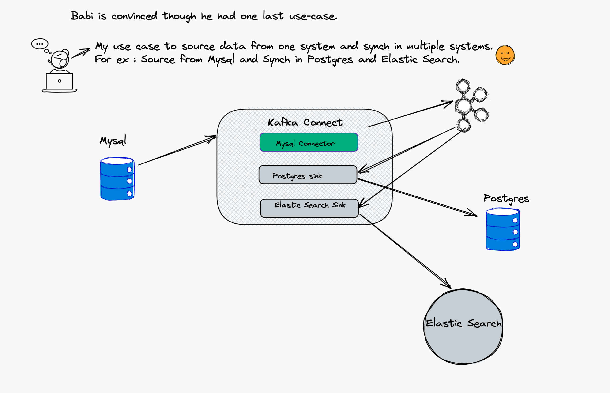

# Change Data Capture from POSTGRES to Elastic Search Using Debezium

A docker compose is used to set up the infrastructure needed for the demo:

- Postgres
- Mysql
- Kafka
  - Zookeeper.
  - Kafka Broker.
  - Kafka Connect with [Debezium](https://debezium.io/), [Postgres and Elastic Search](https://github.com/confluentinc/kafka-connect-elasticsearch) Connectors.
  - kafdrop For UI to Kafka topics.

### 

## Usage

I have created script for loading some data in to mysql. You can find under folder mysql/user_data.sql

```shell
export DEBEZIUM_VERSION=1.4 (or latest)

# Build the docker file using docker compose. It will take a while for first time.
docker-compose up --build

# Configure the connectors. For simplicity I created shell script.
As we are using geo spatial tables. This table is only sinked with Elastic Search alone.
For Postgres we need Postgis extension
./init.sh
```

Few tables were loaded in to Mysql `users` and `geom` (Geo Spatial table)

### Check the data in Mysql

```shell
docker-compose exec mysql bash -c 'mysql -u $MYSQL_USER  -p$MYSQL_PASSWORD user_data'
```

```sql
mysql: [Warning] Using a password on the command line interface can be insecure.
Reading table information for completion of table and column names
You can turn off this feature to get a quicker startup with -A

Welcome to the MySQL monitor.  Commands end with ; or \g.
Your MySQL connection id is 2
Server version: 5.7.35-log MySQL Community Server (GPL)

Copyright (c) 2000, 2021, Oracle and/or its affiliates.

Oracle is a registered trademark of Oracle Corporation and/or its
affiliates. Other names may be trademarks of their respective
owners.

Type 'help;' or '\h' for help. Type '\c' to clear the current input statement.

mysql> select * from users;
+----+---------------+-------------------------+---------------+---------------------+
| id | name          | email                   | mobile_number | created_at          |
+----+---------------+-------------------------+---------------+---------------------+
|  1 | John Smith    | john.smith@email.com    | 9876543211    | 2021-08-14 05:49:48 |
|  2 | Tom Cruise    | tom.cruise@gmail.com    | 9876543212    | 2021-08-14 05:49:48 |
|  3 | Jack Peterson | jack.peterson@gmail.com | 9876543213    | 2021-08-14 05:49:48 |
|  4 | John Wick     | john.wick@gmail.com     | 9876543214    | 2021-08-14 05:49:48 |
|  5 | Jason Bourne  | jason.bourne@gmail.com  | 9876543215    | 2021-08-14 05:49:48 |
|  6 | Jack Reacher  | jack.reacher@gmail.com  | 9876543216    | 2021-08-14 05:49:48 |
|  7 | James Bond    | james.bond@gmail.com    | 9876543217    | 2021-08-14 05:49:48 |
|  8 | Terminator    | terminator@gmail.com    | 9876543218    | 2021-08-14 05:49:48 |
|  9 | Punisher      | punisher@gmail.com      | 9876543219    | 2021-08-14 05:49:48 |
+----+---------------+-------------------------+---------------+---------------------+
9 rows in set (0.00 sec)

mysql> select * from geom;
+----+---------------------------+------+
| id | g                         | h    |
+----+---------------------------+------+
|  1 |        ���Y@P6�
3� | NULL |
|  2 |        ����X@P6�
9� | NULL |
|  3 |        �):�ˏH@P6�
=� | NULL |
+----+---------------------------+------+
3 rows in set (0.00 sec)
```

### Verify the content in Postgres DB instance

```shell
docker-compose exec postgres bash -c 'psql -U $POSTGRES_USER $POSTGRES_DB -c "select * from users"'
```

```sql
      name      |      created_at      | id | mobile_number |          email
---------------+----------------------+----+---------------+-------------------------
 John Smith    | 2021-08-14T05:49:48Z |  1 | 9876543211    | john.smith@email.com
 Tom Cruise    | 2021-08-14T05:49:48Z |  2 | 9876543212    | tom.cruise@gmail.com
 Jack Peterson | 2021-08-14T05:49:48Z |  3 | 9876543213    | jack.peterson@gmail.com
 John Wick     | 2021-08-14T05:49:48Z |  4 | 9876543214    | john.wick@gmail.com
 Jason Bourne  | 2021-08-14T05:49:48Z |  5 | 9876543215    | jason.bourne@gmail.com
 Jack Reacher  | 2021-08-14T05:49:48Z |  6 | 9876543216    | jack.reacher@gmail.com
 James Bond    | 2021-08-14T05:49:48Z |  7 | 9876543217    | james.bond@gmail.com
 Terminator    | 2021-08-14T05:49:48Z |  8 | 9876543218    | terminator@gmail.com
 Punisher      | 2021-08-14T05:49:48Z |  9 | 9876543219    | punisher@gmail.com
(9 rows)
```

### Verify Content In Elastic Search

```shell
curl http://localhost:9200/users/_search\?pretty
```

```json
{
  "took": 10,
  "timed_out": false,
  "_shards": {
    "total": 1,
    "successful": 1,
    "skipped": 0,
    "failed": 0
  },
  "hits": {
    "total": {
      "value": 9,
      "relation": "eq"
    },
    "max_score": 1.0,
    "hits": [
      {
        "_index": "users",
        "_type": "user",
        "_id": "3",
        "_score": 1.0,
        "_source": {
          "id": 3,
          "name": "Jack Peterson",
          "email": "jack.peterson@gmail.com",
          "mobile_number": "9876543213",
          "created_at": "2021-08-14T05:49:48Z"
        }
      },
      {
        "_index": "users",
        "_type": "user",
        "_id": "1",
        "_score": 1.0,
        "_source": {
          "id": 1,
          "name": "John Smith",
          "email": "john.smith@email.com",
          "mobile_number": "9876543211",
          "created_at": "2021-08-14T05:49:48Z"
        }
      },
      {
        "_index": "users",
        "_type": "user",
        "_id": "2",
        "_score": 1.0,
        "_source": {
          "id": 2,
          "name": "Tom Cruise",
          "email": "tom.cruise@gmail.com",
          "mobile_number": "9876543212",
          "created_at": "2021-08-14T05:49:48Z"
        }
      },
      {
        "_index": "users",
        "_type": "user",
        "_id": "9",
        "_score": 1.0,
        "_source": {
          "id": 9,
          "name": "Punisher",
          "email": "punisher@gmail.com",
          "mobile_number": "9876543219",
          "created_at": "2021-08-14T05:49:48Z"
        }
      },
      {
        "_index": "users",
        "_type": "user",
        "_id": "4",
        "_score": 1.0,
        "_source": {
          "id": 4,
          "name": "John Wick",
          "email": "john.wick@gmail.com",
          "mobile_number": "9876543214",
          "created_at": "2021-08-14T05:49:48Z"
        }
      },
      {
        "_index": "users",
        "_type": "user",
        "_id": "5",
        "_score": 1.0,
        "_source": {
          "id": 5,
          "name": "Jason Bourne",
          "email": "jason.bourne@gmail.com",
          "mobile_number": "9876543215",
          "created_at": "2021-08-14T05:49:48Z"
        }
      },
      {
        "_index": "users",
        "_type": "user",
        "_id": "6",
        "_score": 1.0,
        "_source": {
          "id": 6,
          "name": "Jack Reacher",
          "email": "jack.reacher@gmail.com",
          "mobile_number": "9876543216",
          "created_at": "2021-08-14T05:49:48Z"
        }
      },
      {
        "_index": "users",
        "_type": "user",
        "_id": "7",
        "_score": 1.0,
        "_source": {
          "id": 7,
          "name": "James Bond",
          "email": "james.bond@gmail.com",
          "mobile_number": "9876543217",
          "created_at": "2021-08-14T05:49:48Z"
        }
      },
      {
        "_index": "users",
        "_type": "user",
        "_id": "8",
        "_score": 1.0,
        "_source": {
          "id": 8,
          "name": "Terminator",
          "email": "terminator@gmail.com",
          "mobile_number": "9876543218",
          "created_at": "2021-08-14T05:49:48Z"
        }
      }
    ]
  }
}
```

### Now Let us add user in users table

```shell
docker-compose exec mysql bash -c 'mysql -u $MYSQL_USER  -p$MYSQL_PASSWORD user_data'
```

```sql
INSERT INTO users
    -> VALUES (default,"Will Smiths","will.smiths@email.com","8876543211", default);
Query OK, 1 row affected (0.04 sec)
```

Insertion of this record is successful.

### Now Let us verify in Postgres and Elastic Search

#### Check Postgres

```shell
docker-compose exec postgres bash -c 'psql -U $POSTGRES_USER $POSTGRES_DB -c "select * from users"'
```

A new row by name Will Smiths is added.

```sql
     name      |      created_at      | id | mobile_number |          email
---------------+----------------------+----+---------------+-------------------------
 John Smith    | 2021-08-14T05:49:48Z |  1 | 9876543211    | john.smith@email.com
 Tom Cruise    | 2021-08-14T05:49:48Z |  2 | 9876543212    | tom.cruise@gmail.com
 Jack Peterson | 2021-08-14T05:49:48Z |  3 | 9876543213    | jack.peterson@gmail.com
 John Wick     | 2021-08-14T05:49:48Z |  4 | 9876543214    | john.wick@gmail.com
 Jason Bourne  | 2021-08-14T05:49:48Z |  5 | 9876543215    | jason.bourne@gmail.com
 Jack Reacher  | 2021-08-14T05:49:48Z |  6 | 9876543216    | jack.reacher@gmail.com
 James Bond    | 2021-08-14T05:49:48Z |  7 | 9876543217    | james.bond@gmail.com
 Terminator    | 2021-08-14T05:49:48Z |  8 | 9876543218    | terminator@gmail.com
 Punisher      | 2021-08-14T05:49:48Z |  9 | 9876543219    | punisher@gmail.com
 Will Smiths   | 2021-08-14T05:55:21Z | 10 | 8876543211    | will.smiths@email.com
(10 rows)
```

#### Check Elastic Search for id 10

```shell
curl -XGET "http://elastic:9200/users/_search" -H 'Content-Type: application/json' -d'{  "query": {    "bool": {      "must": [        {          "match": {            "id": 10          }        }      ]    }  }}'
```

```json
{
  "took": 0,
  "timed_out": false,
  "_shards": {
    "total": 1,
    "successful": 1,
    "skipped": 0,
    "failed": 0
  },
  "hits": {
    "total": {
      "value": 1,
      "relation": "eq"
    },
    "max_score": 1.0,
    "hits": [
      {
        "_index": "users",
        "_type": "user",
        "_id": "10",
        "_score": 1.0,
        "_source": {
          "id": 10,
          "name": "Will Smiths",
          "email": "will.smiths@email.com",
          "mobile_number": "8876543211",
          "created_at": "2021-08-14T05:55:21Z"
        }
      }
    ]
  }
}
```

### Now update the previous record and see if it's reflected or not in target system

Let us update the previously created record.

```shell
docker-compose exec mysql bash -c 'mysql -u $MYSQL_USER -p$MYSQL_PASSWORD user_data'
```

```sql
update users set name='Will Smith', email='will.smith@gmail.com' where id = 10;
Query OK, 1 row affected (0.04 sec)
Rows matched: 1  Changed: 1  Warnings: 0
```

### Now verify the same in Postgres and Elastic Search

#### Verify in Postgres

```shell
docker-compose exec postgres bash -c 'psql -U $POSTGRES_USER $POSTGRES_DB'
```

The record is modified.

```sql
psql (9.6.22)
Type "help" for help.

inventoryDB=# select * from users where id = 10;
    name    |      created_at      | id | mobile_number |        email
------------+----------------------+----+---------------+----------------------
 Will Smith | 2021-08-14T05:55:21Z | 10 | 8876543211    | will.smith@gmail.com
(1 row)
```

Verify in Elastic Search too.

```shell
curl -XGET "http://elastic:9200/users/_search" -H 'Content-Type: application/json' -d'{  "query": {    "bool": {      "must": [        {          "match": {            "id": 10          }        }      ]    }  }}'
```

```json
{
  "took": 2,
  "timed_out": false,
  "_shards": {
    "total": 1,
    "successful": 1,
    "skipped": 0,
    "failed": 0
  },
  "hits": {
    "total": {
      "value": 1,
      "relation": "eq"
    },
    "max_score": 1.0,
    "hits": [
      {
        "_index": "users",
        "_type": "user",
        "_id": "10",
        "_score": 1.0,
        "_source": {
          "id": 10,
          "name": "Will Smith",
          "email": "will.smith@gmail.com",
          "mobile_number": "8876543211",
          "created_at": "2021-08-14T05:55:21Z"
        }
      }
    ]
  }
}
```

### Now Let us delete the product and see whether it reflects or not in target system

```shell
docker-compose exec mysql bash -c 'mysql -u $MYSQL_USER  -p$MYSQL_PASSWORD user_data'
```

```sql
delete from users where id = 10;
Query OK, 1 row affected (0.03 sec)
```

### Query in Postgres and Elastic Search to verify

#### In Postgres

```sql
inventoryDB=# select * from users where id = 10;
 name | created_at | id | mobile_number | email
------+------------+----+---------------+-------
(0 rows)
```

#### In Elastic Search

```shell
curl -XGET "http://elastic:9200/users/_search" -H 'Content-Type: application/json' -d'{  "query": {    "bool": {      "must": [        {          "match": {            "id": 10          }        }      ]    }  }}'
```

Record is deleted.

```json
{
  "took": 406,
  "timed_out": false,
  "_shards": {
    "total": 1,
    "successful": 1,
    "skipped": 0,
    "failed": 0
  },
  "hits": {
    "total": {
      "value": 0,
      "relation": "eq"
    },
    "max_score": null,
    "hits": []
  }
}
```

### Stop the services

```shell
docker-compose down --remove-orphans
```
