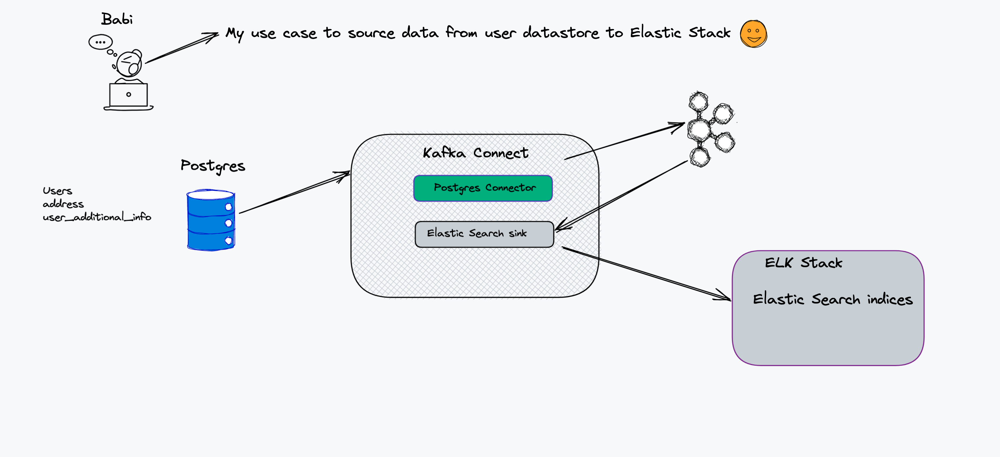
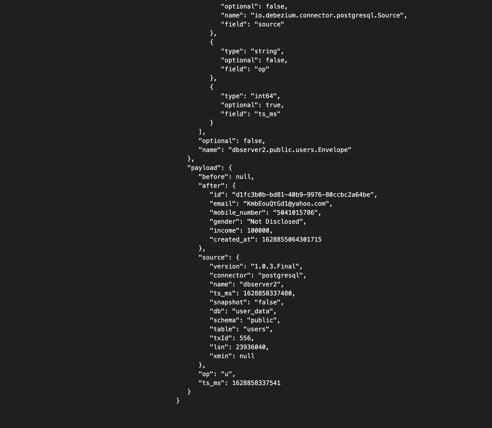

# Change Data Capture from POSTGRES to Elastic Search Using Debezium

A docker compose is used to set up the infrastructure needed for the demo:

- Postgres
- Kafka
  - Zookeeper.
  - Kafka Broker.
  - Kafka Connect with [Debezium](https://debezium.io/) and [Elasticsearch](https://github.com/confluentinc/kafka-connect-elasticsearch) Connectors.
  - kafdrop For UI to Kafka topics.
- ElK Stack
  - Elastic Search.
  - Kibana.

### 

## Usage

```shell
export DEBEZIUM_VERSION=1.4 (or latest)

# Build the docker file using docker compose. It will take a while for first time.
docker-compose up --build

# Configure the connectors. For simplicity I created shell script.
./init.sh
```

I have loaded few records during postgres startup the db name is `user_data` and the tables are `users`, `user_address` and `user_additional_info`. So the records will be there when the docker compose is done.

```
FROM debezium/postgres:latest
COPY ./create_schema.sql /home/create_schema.sql
COPY ./seed_data.sql /home/seed_data.sql
COPY ./init-db.sh /docker-entrypoint-initdb.d/init-db.sh
```

### Check the data in postgres database instance

```sql
docker-compose -f docker-compose.yaml exec postgres bash -c 'psql -U $POSTGRES_USER $POSTGRES_DB -c "select * from users"'

                  id                  |          email           | mobile_number |    gender     | income |         created_at
--------------------------------------+--------------------------+---------------+---------------+--------+----------------------------
 d1fc3b0b-bd81-40b9-9976-80ccbc2a64be | KmbEouQtGd1@yahoo.com    | 5041015786    | Not Disclosed | 227105 | 2021-08-13 11:44:24.301715
 d9c20176-7dd0-421c-84a8-50e2c72b6f2f | OqWBcOmBSl2@gmail.com    | 8389885965    | Male          | 577017 | 2021-08-13 11:44:24.301715
 2ab5e4bf-2ab6-4960-9376-058b81c29ba8 | wnkHBtVHSP3@gmail.com    | 4784724083    | Not Disclosed | 600764 | 2021-08-13 11:44:24.301715
 1e9a655c-d654-4fe9-b470-09b389464483 | xKdVVvEHCx4@gmail.com    | 2377279116    | Male          | 401259 | 2021-08-13 11:44:24.301715
 ebd02be0-c5f2-451b-a09b-76bf5b573034 | mTefQNEolN5@yahoo.com    | 4729049666    | Female        | 629036 | 2021-08-13 11:44:24.301715
 6e84dcb7-8cd4-49c8-9aaa-d400777bab1f | kpFjPgkGRa6@hotmail.com  | 8157010772    | Female        |  90135 | 2021-08-13 11:44:24.301715
 d63a2e6b-2e6b-479a-a3f2-1b444f1b93ff | kupqLBUGfn7@yahoo.com    | 2150824498    | Not Disclosed | 737778 | 2021-08-13 11:44:24.301715
 16c091d3-8a6c-41fa-802a-9bb7cb3490ba | sUjspbBLHo8@gmail.com    | 0886011971    | Female        | 233207 | 2021-08-13 11:44:24.301715
 ef7cda60-e42a-4ede-bba1-3536d9ba719b | KakQlasOGn9@yahoo.com    | 3867870951    | Female        | 873634 | 2021-08-13 11:44:24.301715
 5c568108-c25e-47c6-9d43-d63291479a02 | URHpBMjIjF10@hotmail.com | 6699861870    | Male          | 480001 | 2021-08-13 11:44:24.301715
(10 rows)
```

### Verify the content in elastic search index

```shell
curl http://localhost:9200/users/_search\?pretty
```

```json
{
  "took": 0,
  "timed_out": false,
  "_shards": {
    "total": 1,
    "successful": 1,
    "skipped": 0,
    "failed": 0
  },
  "hits": {
    "total": {
      "value": 10,
      "relation": "eq"
    },
    "max_score": 1.0,
    "hits": [
      {
        "_index": "users",
        "_type": "user",
        "_id": "d1fc3b0b-bd81-40b9-9976-80ccbc2a64be",
        "_score": 1.0,
        "_source": {
          "id": "d1fc3b0b-bd81-40b9-9976-80ccbc2a64be",
          "email": "KmbEouQtGd1@yahoo.com",
          "mobile_number": "5041015786",
          "gender": "Not Disclosed",
          "income": 227105,
          "created_at": 1628855064301715
        }
      },
      {
        "_index": "users",
        "_type": "user",
        "_id": "d63a2e6b-2e6b-479a-a3f2-1b444f1b93ff",
        "_score": 1.0,
        "_source": {
          "id": "d63a2e6b-2e6b-479a-a3f2-1b444f1b93ff",
          "email": "kupqLBUGfn7@yahoo.com",
          "mobile_number": "2150824498",
          "gender": "Not Disclosed",
          "income": 737778,
          "created_at": 1628855064301715
        }
      },
      {
        "_index": "users",
        "_type": "user",
        "_id": "16c091d3-8a6c-41fa-802a-9bb7cb3490ba",
        "_score": 1.0,
        "_source": {
          "id": "16c091d3-8a6c-41fa-802a-9bb7cb3490ba",
          "email": "sUjspbBLHo8@gmail.com",
          "mobile_number": "0886011971",
          "gender": "Female",
          "income": 233207,
          "created_at": 1628855064301715
        }
      },
      {
        "_index": "users",
        "_type": "user",
        "_id": "ef7cda60-e42a-4ede-bba1-3536d9ba719b",
        "_score": 1.0,
        "_source": {
          "id": "ef7cda60-e42a-4ede-bba1-3536d9ba719b",
          "email": "KakQlasOGn9@yahoo.com",
          "mobile_number": "3867870951",
          "gender": "Female",
          "income": 873634,
          "created_at": 1628855064301715
        }
      },
      {
        "_index": "users",
        "_type": "user",
        "_id": "5c568108-c25e-47c6-9d43-d63291479a02",
        "_score": 1.0,
        "_source": {
          "id": "5c568108-c25e-47c6-9d43-d63291479a02",
          "email": "URHpBMjIjF10@hotmail.com",
          "mobile_number": "6699861870",
          "gender": "Male",
          "income": 480001,
          "created_at": 1628855064301715
        }
      },
      {
        "_index": "users",
        "_type": "user",
        "_id": "d9c20176-7dd0-421c-84a8-50e2c72b6f2f",
        "_score": 1.0,
        "_source": {
          "id": "d9c20176-7dd0-421c-84a8-50e2c72b6f2f",
          "email": "OqWBcOmBSl2@gmail.com",
          "mobile_number": "8389885965",
          "gender": "Male",
          "income": 577017,
          "created_at": 1628855064301715
        }
      },
      {
        "_index": "users",
        "_type": "user",
        "_id": "2ab5e4bf-2ab6-4960-9376-058b81c29ba8",
        "_score": 1.0,
        "_source": {
          "id": "2ab5e4bf-2ab6-4960-9376-058b81c29ba8",
          "email": "wnkHBtVHSP3@gmail.com",
          "mobile_number": "4784724083",
          "gender": "Not Disclosed",
          "income": 600764,
          "created_at": 1628855064301715
        }
      },
      {
        "_index": "users",
        "_type": "user",
        "_id": "1e9a655c-d654-4fe9-b470-09b389464483",
        "_score": 1.0,
        "_source": {
          "id": "1e9a655c-d654-4fe9-b470-09b389464483",
          "email": "xKdVVvEHCx4@gmail.com",
          "mobile_number": "2377279116",
          "gender": "Male",
          "income": 401259,
          "created_at": 1628855064301715
        }
      },
      {
        "_index": "users",
        "_type": "user",
        "_id": "ebd02be0-c5f2-451b-a09b-76bf5b573034",
        "_score": 1.0,
        "_source": {
          "id": "ebd02be0-c5f2-451b-a09b-76bf5b573034",
          "email": "mTefQNEolN5@yahoo.com",
          "mobile_number": "4729049666",
          "gender": "Female",
          "income": 629036,
          "created_at": 1628855064301715
        }
      },
      {
        "_index": "users",
        "_type": "user",
        "_id": "6e84dcb7-8cd4-49c8-9aaa-d400777bab1f",
        "_score": 1.0,
        "_source": {
          "id": "6e84dcb7-8cd4-49c8-9aaa-d400777bab1f",
          "email": "kpFjPgkGRa6@hotmail.com",
          "mobile_number": "8157010772",
          "gender": "Female",
          "income": 90135,
          "created_at": 1628855064301715
        }
      }
    ]
  }
}
```

### Now update any record and see if its reflected or not

```sql
docker-compose -f docker-compose.yaml exec postgres bash -c 'psql -U $POSTGRES_USER $POSTGRES_DB'                
psql (9.6.22)
Type "help" for help.

user_data=# update users set income=100000 where id = 'd1fc3b0b-bd81-40b9-9976-80ccbc2a64be';
UPDATE 1
user_data=#
```

Now verify the same in elastic search

```shell
curl -XGET "http://elastic:9200/users/_search" -H 'Content-Type: application/json' -d'{  "query": {    "bool": {      "must": [        {          "match": {            "id.keyword": "d1fc3b0b-bd81-40b9-9976-80ccbc2a64be"          }        }      ]    }  }}'
```

```json
{
  "took": 0,
  "timed_out": false,
  "_shards": {
    "total": 1,
    "successful": 1,
    "skipped": 0,
    "failed": 0
  },
  "hits": {
    "total": {
      "value": 1,
      "relation": "eq"
    },
    "max_score": 1.9924302,
    "hits": [
      {
        "_index": "users",
        "_type": "user",
        "_id": "d1fc3b0b-bd81-40b9-9976-80ccbc2a64be",
        "_score": 1.9924302,
        "_source": {
          "id": "d1fc3b0b-bd81-40b9-9976-80ccbc2a64be",
          "email": "KmbEouQtGd1@yahoo.com",
          "mobile_number": "5041015786",
          "gender": "Not Disclosed",
          "income": 100000,
          "created_at": 1628855064301715
        }
      }
    ]
  }
}
```

The income is modified too.

Instead of CURL commands you can use kibana dev tools to query the indices. Please Click [here](<http://localhost:5601/app/kibana#/dev_tools/console?_g=()>) for the local instance.

I have used kafdrop to view messages in kafka topics. Please click [here](http://localhost:9100/). Go to users topic and click view messages and then click messages again you will all messages received from DB to kafka topic from kafka connect using debezium.

### 

### Now Let us delete the user and see if that reflects that in elastic search or not

```sql
user_data=# delete from user_additional_info where user_id = 'd1fc3b0b-bd81-40b9-9976-80ccbc2a64be';
DELETE 1
user_data=# delete from user_address where user_id = 'd1fc3b0b-bd81-40b9-9976-80ccbc2a64be';
DELETE 2
user_data=# delete from users where id = 'd1fc3b0b-bd81-40b9-9976-80ccbc2a64be';
DELETE 1
user_data=#
```

Query in Elastic Search

```shell
curl -XGET "http://elastic:9200/users/_search" -H 'Content-Type: application/json' -d'{  "query": {    "bool": {      "must": [        {          "match": {            "id.keyword": "d1fc3b0b-bd81-40b9-9976-80ccbc2a64be"          }        }      ]    }  }}'
```

```json
{
  "took": 98,
  "timed_out": false,
  "_shards": {
    "total": 1,
    "successful": 1,
    "skipped": 0,
    "failed": 0
  },
  "hits": {
    "total": {
      "value": 0,
      "relation": "eq"
    },
    "max_score": null,
    "hits": []
  }
}
```

### Stop the services

```shell
docker-compose down --remove-orphans
```
